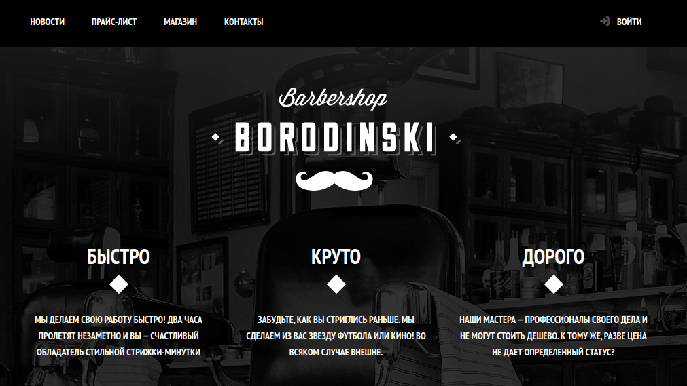

# Учебный проект «Барбершоп»

Сайт барбершопа «Бородинский», сверстанный в рамках курса «HTML и CSS, уровень 1» от HTML Academy. Страницы не адаптивные.

[Посмотреть работу.](https://panicswtch.github.io/barbershop-simple)

**Стек**: HTML5, CSS (flex).

## Что сделано:
1. Главная страница;
2. Страница с ценами;
3. Каталог товаров;
4. Карточка товара.

## Как можно улучшить:
* Добавить адаптивность;
* Добавить страницу с контактами;
* Добавить всплывающие окна.